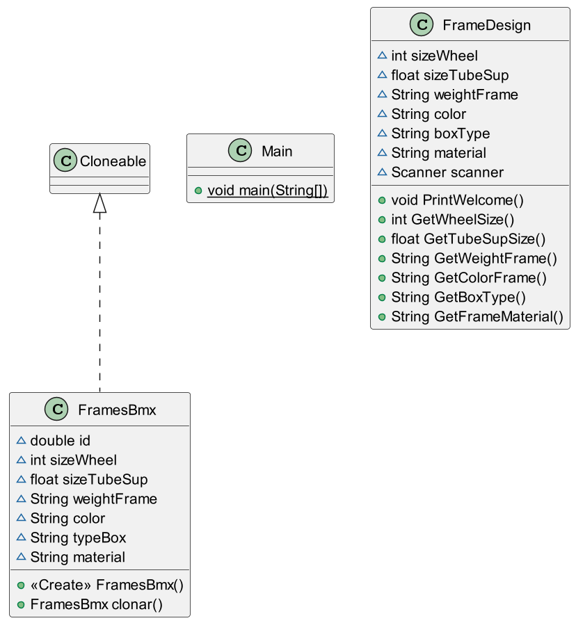
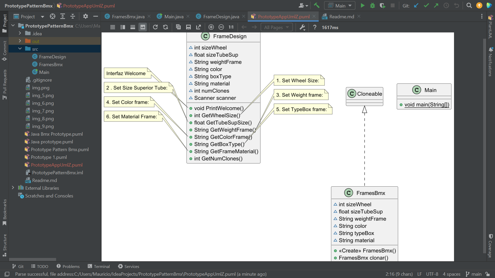
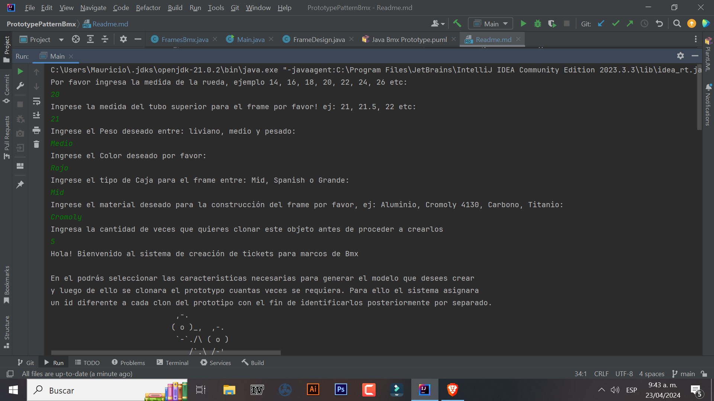
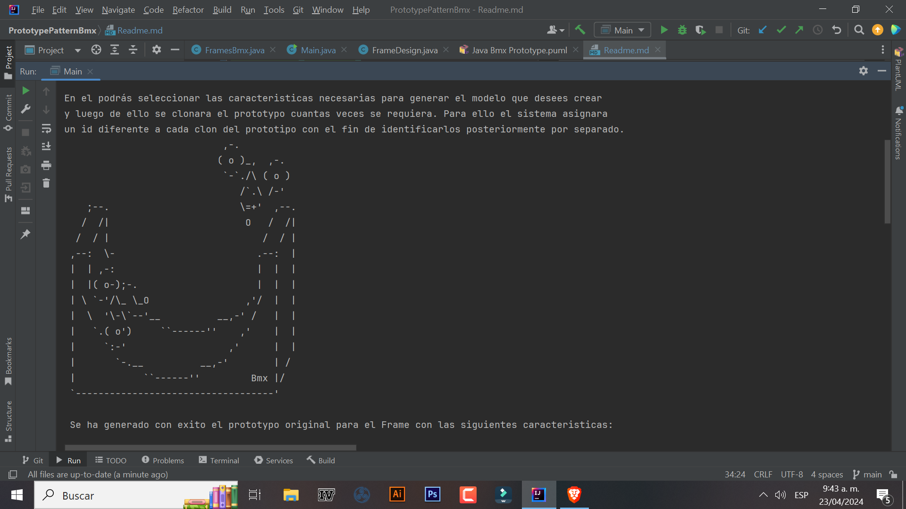
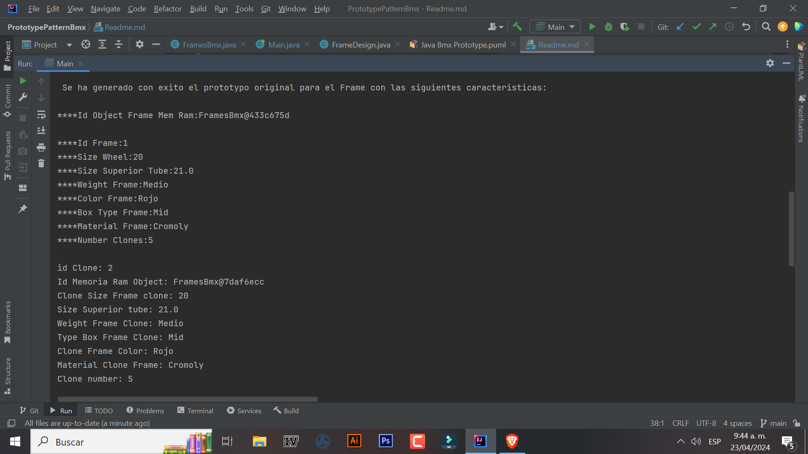
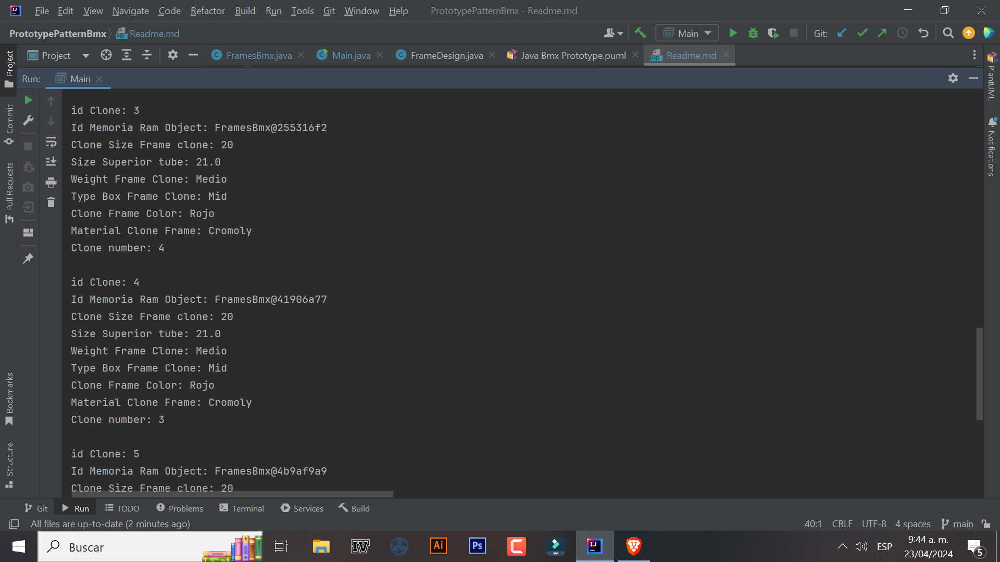
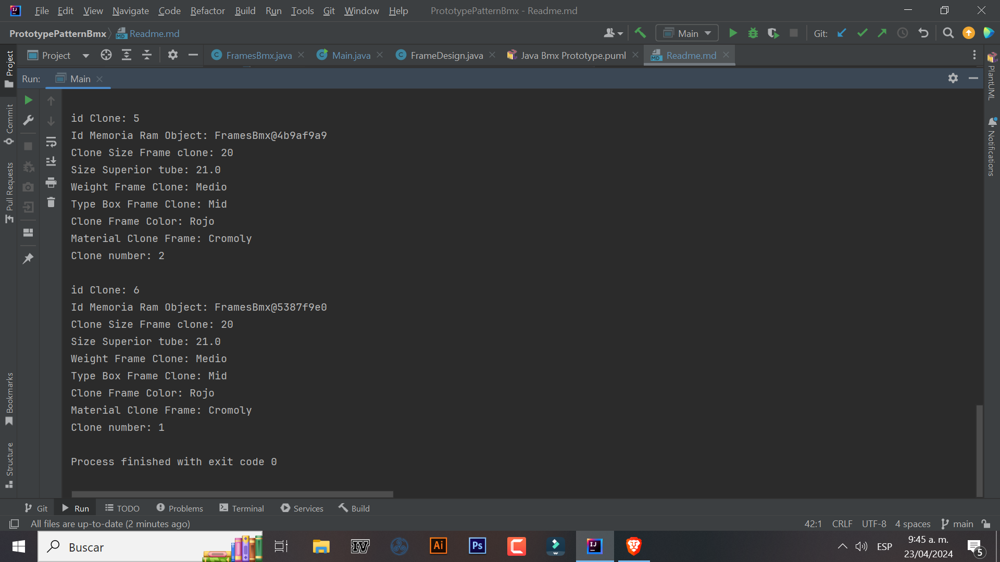

Ejercicio Patrón de diseño creacional Prototype:

En un inicio éste Repositorio busca clonar la cantidad de objetos necesarios para la 
manufactura de un lote de marcos o chasis tipo - Bmx, aplicando los conceptos básicos de la Poo 
y el Patrón de diseño creacional Prototype quien hace uso de la interfaz Cloneable para clonar 
el prototypo especifico cuantas veces se requiera.

Cómo bien se observa, contamos con nuestro programa principal llamado Main, una Clase adicional 
llamada FrameDesign, desde la cual se capturan los datos a través de métodos de entrada (Scanner) 
ingresados por el usuario. Además tenemos la Clase FramesBmx mediante la cual representaremos 
el objeto que vamos a proceder a: Crear, Prototypar y Clonar multiples vecces a través del Patrón
de diseño Prototype. Siguiendo el diagrama Uml, nuestra Clase FramesBmx Implementa una Interfaz nativa,
llamada Cloneable(I), proporcionada por la JDK de Java y es a través de ésta, que podemos Clonar nuevos
objetos, fácilmente.

Clonar un objeto será tan sencillo como lanzar una excepción controlada como la siguiente:

try {
      FramesBmx clonado = framesBmx.clonar();
      clonado.id = clonado.id + 1;
      System.out.println("\nid Clone: " + clonado.id + "\nClone Size Frame clone: " + clonado.sizeWheel + "\nSize Superior tube: " + clonado.sizeTubeSup + "\nWeight Frame Clone: " + clonado.weightFrame + "\nType Box Frame Clone: " + clonado.typeBox + "\nClone Frame Color: " + clonado.color + "\nMaterial Clone Frame: " + clonado.material);
    } catch (CloneNotSupportedException e){
      System.out.println("El objeto no se puede Clonal: " + e.getMessage());
}

En este ejemplo clonamos un objeto previamente definido, pero ahora le modificamos únicamente su id
consecutivamente. Así hemos desarrollado mediante un nuevo tipo de Patrón de diseño creacional, la 
capacidad de crear nuevos objetos, clonados a partir de un objeto especifico o varios objetos. FramesBmx.java

Resultados por Consola:

